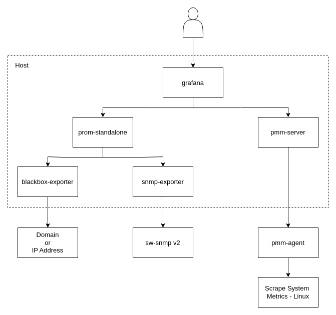

# Documentations

## Architecture

Here is the diagram for the stacks that we use for monitoring:

These stacks includes:
* `pmm-server` -> a bunch of monitoring tools created by percona, including grafana and prometheus, we use this to scrape generic linux client system metrics. 
* `prom-standalone` -> standalone prometheus for our custom prometheus scraping.
* `blackbox-exporter` ->  a blackbox exporter designed for ICMP (ping) monitoring of domains/IPs and collecting related metrics.
* `snmp-exporter` -> exporting snmp-v2 to prometheus metrics.

## Prerequisites

Before you begin, make sure you have the necessary configuration files ready. You can use the provided example files as a starting point:

- Copy `ansible/group_vars/all-example.yml` to `group_vars/all.yml`.
- Copy `ansible/inventory-example` to `inventory`.

Modify these files according to your environment settings.

## Operational Runbook

* [Local Environment Setup](./setup-local.md)
* [Adding new linux client](adding-new-linux-client.md)
* [Adding new ZFS exporter client](adding-new-zfs-client.md)
* [Adding new switch client](adding-new-switch-client.md)
* [Changing retention](changing-retentions.md)
